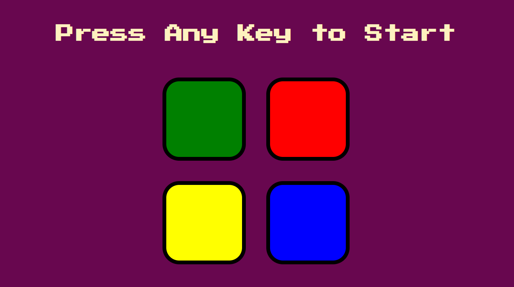

# The Memory Game

###### [ Challenge Your Self and Test Your Memory ]

## How To Play The Game :
------------------------

1.  Each level The game will generate a random color

2. The player should memorize this color

3. Each time the game generates a new level the player should repress the previous sequence of generated
   colors plus the new generated color

------------------------

###### Playing The GAME

-----------------------

###### Losing The GAME

